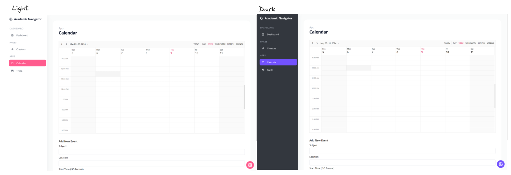

**COM S 319 Final Project Documentation**  
**Academic-Navigator**

**Team Members**  
Haad Cheema ([haad736@iastate.edu](mailto:haad736@iastate.edu))  
Dhairya Kachalia ([dhairyak@iastate.edu](mailto:dhairyak668@gmail.com))

**Course Information**  
Course number: COMS 319   
Professor: Dr. Abraham N Aldaco Gastelum,

**Academic-Navigator**  
**Index**

* Project Description  
* Project Structure

* Structure Diagram (Files and Directory)  
  - Entirety of the code of the program (Github link for Copy of the code)

* Database Structure  
  - User table  
  - Todos table  
  - Events table

* Software Installation Configuration  
  - Node  
  - React  
  - Express  
  - MySql

* Web Page Navigation

Project Description:  
This project is designed to showcase our understanding and application of REACT and routing. Here, you can navigate through components by performing various CRUD operations. 

This Application aims to help users be more productive. It provides users the features like managing to-do lists, events lists, and calendars. A user can customize their tasks and events according to their choice and this information is stored and can be accessed from a database system (MYSQL). 

Project Structure:   
Root Directory: The root directory has the academic-navigator directory for the frontend documents and the backend directory. 

Frontend Directory: Holds all React components, CSS styling, utility scripts. It’s organized into subdirectories such as components for reusable UI parts, pages for components that represent pages, and context for React context files.

Backend Directory: Includes Node.js server setup files, API route definitions (routes directory), middleware for handling requests, and scripts for database interactions.

Structure Diagram:  

Code of project: [https://github.com/Haad1000/AcademicNavigator.git](https://github.com/Haad1000/AcademicNavigator.git)

DataBase Structure:  
We used MySQL as it is a relational database. This helped us create and manage One to Many relationships between users and todos and users and events. A Delete Cascade Constraint is also applied such that changes to the users table cascades to the other tables. 

Users Table:

Todos table:  

Events Table:  

Software Installation and Configuration  
**1\.**  **NodeJS** 

●      **Download**: Visit the official NodeJS website at [https://nodejs.org](https://nodejs.org/) and download the installer for your operating system.

●      **Installation**: Run the downloaded installer, following the prompts to complete the installation. Include NPM (Node Package Manager) as it is essential for managing JavaScript packages.

●      **Verification**: Open a command prompt or terminal and type **node \-v** and **npm \-v** to verify the installation.

**2**. **React** 

●   **Setup**: React projects are typically initialized with Create React App. Ensure NodeJS is installed, then run **npx create-react-app my-app** in your terminal to create a new React application.

●  **Directory Change**: Navigate into your project directory with **cd my-app**.

● **Start the Development Server**: Run **npm start** to launch the application on a local development server.

## **3\.**  **Express**

●      **Installation**: In your NodeJS application directory, run **npm install express body-parser cors** to install Express and other dependencies in your **package.json** file.

●      **Server Setup**: Create a file named **App.js** and include the basic Express server connection.

●  	**Run Server**: Run npm install \-g nodemon. Execute **nodemon App.js** to start the server.

## **4\.**  **MySQL**

●      **Download**: Go to https://dev.mysql.com/downloads/mysql/ and download the MySQL Community Server for your OS.

●      **Installation**: Follow the installation guide specific to your operating system provided on the MySQL website.

●      **Connection**: Use the MySQL client in your NodeJS application to connect to the database. Install the client via NPM (**npm install mysql2**) and use it to connect to the local database instance.

NOTE: if cloning the project, do npm install for both the backend and frontend folders to install all dependencies that are utilized.

**Web Page Navigation:**

****

****

**Theme Customization**

****

**Creators Page**

****

**Calendar Page**

****

**Multiple Views:**  
****

**Trello (To-Do Page):**

****

